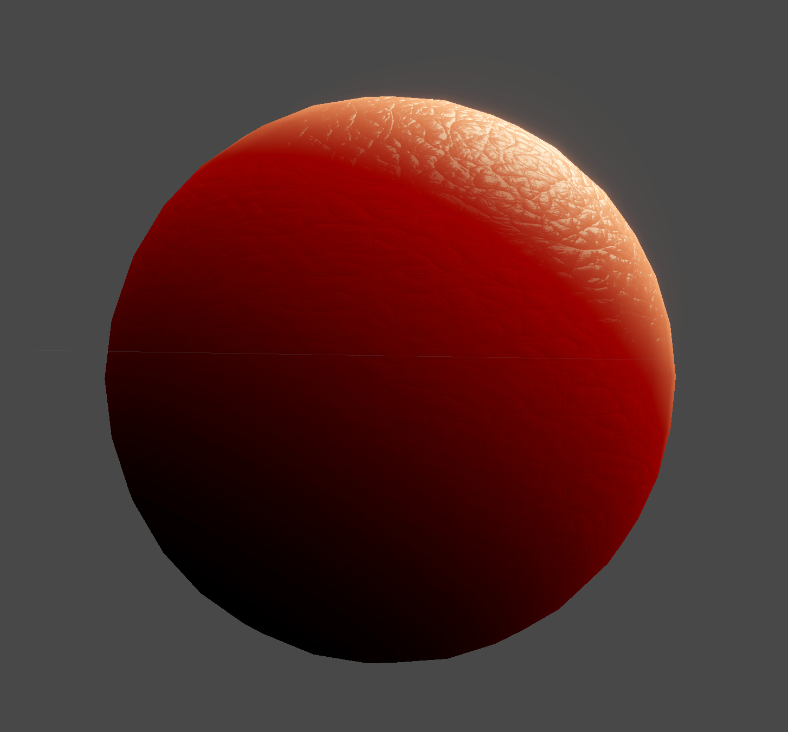

# Unity SSS Amplify Scattering 拡張

## 概要

このシェーダは、UnityのUniversal Render Pipeline（URP）標準のLitシェーダの法線処理と、Amplify Shader EditorのTranslucency機能をベースに、肌の質感表現に特化した拡張を行ったものです。

物理的なサブサーフェススキャタリング（SSS）を厳密に再現するものではありませんが、**計算コストは通常のLitシェーダと同等**で、手軽にリアルな肌の雰囲気を演出できます。

Translucency（透過）部分はAmplify Shader Editor標準のノードを利用しつつ、透過光の拡散方向を調整することで、より自然な見た目になるよう工夫しています。

## 動作確認環境

- Unity 6000.1.0f1
- Amplify Shader Editor v1.9.9.1

---